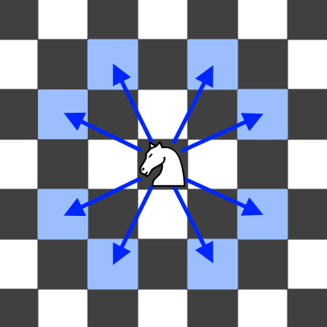

# 688. “马”在棋盘上的概率

## 题目地址

[https://leetcode-cn.com/problems/knight-probability-in-chessboard/](https://leetcode-cn.com/problems/knight-probability-in-chessboard/)

## 题目描述

```java
已知一个 NxN 的国际象棋棋盘，棋盘的行号和列号都是从 0 开始。即最左上角的格子记为 (0, 0)，最右下角的记为 (N-1, N-1)。 

现有一个 “马”（也译作 “骑士”）位于 (r, c) ，并打算进行 K 次移动。 

如下图所示，国际象棋的 “马” 每一步先沿水平或垂直方向移动 2 个格子，然后向与之相垂直的方向再移动 1 个格子，共有 8 个可选的位置。
```



```java
现在 “马” 每一步都从可选的位置（包括棋盘外部的）中独立随机地选择一个进行移动，直到移动了 K 次或跳到了棋盘外面。

求移动结束后，“马” 仍留在棋盘上的概率。
```

## 前置知识

- 动态规划
- 数组

## 分析

读完题也不难发现是个动态规划问题，并且还有爬楼梯的影子，只不过他的移动方式是类似“马走日”的方式，也就是当前位置可以由其他八个位置移动过来。更细致地说：

- 我们用个二维数组来存储马跳到每个格子的概率
- 首先，开一个二维数组来存初始状态，即马的初始状态概率为1，其他位置都为0。
- 接下来我们按步一次一次更新二维数组每个位置的概率，我们可以通过当前位置来知道上一轮有哪些地方（在棋盘内合法的位置）的马跳一次可以到达该位置，这样我们把这些地方的概率x0.125（因为这些地方每一个都有八种选择路线，选择到该位置的概率自然是1/8）加到当前的位置上即完成更新。
- 该次棋盘更新完成要把该棋盘作为上一轮的状态棋盘以便下次循环来使用

## 代码：

### Java

```java
class Solution {

    private int[][] dir = {{-1, -2}, {1, -2}, {2, -1}, {2, 1}, {1, 2}, {-1, 2}, {-2, 1}, {-2, -1}};
    
    public double knightProbability(int N, int K, int r, int c) {

        double[][] dp = new double[N][N];
        dp[r][c] = 1;

        for (int step = 1; step <= K; step++) {

            double[][] dpTemp = new double[N][N];

            for (int i = 0; i < N; i++)
                for (int j = 0; j < N; j++)
                    for (int[] direction : dir) {

                        int lastR = i - direction[0];
                        int lastC = j - direction[1];
                        if (lastR >= 0 && lastR < N && lastC >= 0 && lastC < N)
                            dpTemp[i][j] += dp[lastR][lastC] * 0.125;
                    }

            dp = dpTemp;
        }
        
        double res = 0;

        for (int i = 0; i < N; i++)
            for (int j = 0; j < N; j++)
                res += dp[i][j];

        return res;
    }
}
```

### 复杂度分析

设：棋盘为$NxN$

时间复杂度：$O(KN^2)$

空间复杂度：$O(N^2)$
